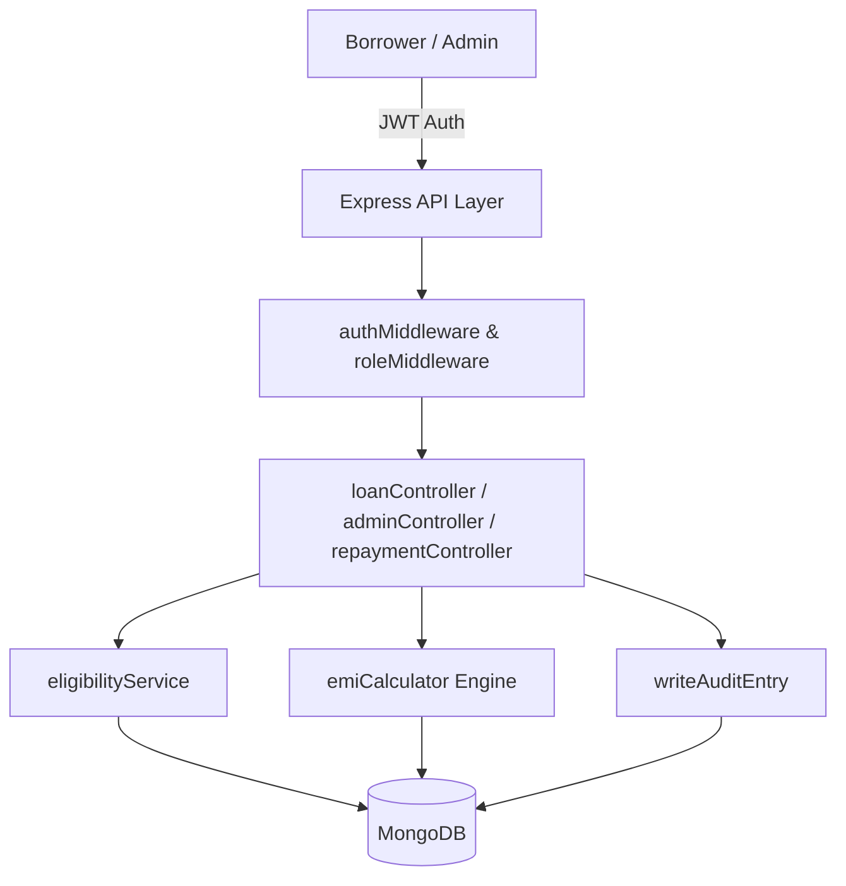

# 🏦 LoanFlex — Automated Loan Processing & EMI Engine

[](https://github.com/divyal-11/loan-emi-system/actions/workflows/ci.yml)
[](https://nodejs.org)
[](https://www.typescriptlang.org)
[](https://nextjs.org)
[](https://www.mongodb.com)
[](https://jestjs.io)

LoanFlex is a production-grade, full-stack financial technology application built with **Node.js, Express, TypeScript, MongoDB, and Next.js**. It features an automated loan state machine, a pure mathematical EMI amortization engine with rounding remainder absorption, timing-safe authentication, read-time overdue calculation, and an immutable audit log trail.

---

## 📐 System Architecture

```
                                  ┌────────────────────────┐
                                  │   Next.js 16 Client    │
                                  │ (App Router + Tailwind)│
                                  └───────────┬────────────┘
                                              │ HTTP / JSON (JWT)
                                              ▼
                                  ┌────────────────────────┐
                                  │   Express API Server   │
                                  │  (TypeScript Node.js)  │
                                  └───────────┬────────────┘
                                              │
         ┌────────────────────────────────────┼────────────────────────────────────┐
         │                                    │                                    │
         ▼                                    ▼                                    ▼
┌─────────────────┐                 ┌──────────────────┐                 ┌──────────────────┐
│  Auth & RBAC    │                 │ Business Logic   │                 │ Audit Logging    │
│  - JWT Bearer   │                 │ - emiCalculator  │                 │ - AuditLog Model │
│  - bcrypt (12)  │                 │ - eligibilitySvc │                 │ - Immutable      │
└────────┬────────┘                 └────────┬─────────┘                 └────────┬─────────┘
         │                                   │                                    │
         └───────────────────────────────────┼────────────────────────────────────┘
                                             │ Mongoose ORM
                                             ▼
                                  ┌────────────────────────┐
                                  │    MongoDB Database    │
                                  │  (4 Core Collections)  │
                                  └────────────────────────┘
```



---

## 🔥 Key Engineering Highlights

### 1. Exact Amortization & Rounding Remainder Absorption (`emiCalculator.ts`)
The monthly EMI is calculated using the compound amortization formula:
$$\text{EMI} = \frac{P \cdot r \cdot (1+r)^n}{(1+r)^n - 1}$$
Standard floating-point operations accumulate rounding errors across multi-year tenures. LoanFlex enforces a **last-installment remainder absorption rule**:
$$\text{Principal}_{\text{last}} = P_{\text{original}} - \sum_{i=1}^{n-1} \text{Principal}_i$$
This guarantees that $\sum_{i=1}^{n} \text{Principal}_i = P_{\text{original}}$ **to the exact cent**, preventing balance leakage.

### 2. Timing-Safe User Enumeration Protection
In `authController.login`, `bcrypt.compare` is executed **unconditionally** against a pre-computed dummy hash even when the email is not registered:
```typescript
const passwordMatch = await bcrypt.compare(password, user?.passwordHash ?? DUMMY_HASH);
```
This keeps execution timing identical regardless of email existence, neutralizing side-channel timing attacks that allow attackers to harvest valid email addresses.

### 3. Read-Time Overdue Calculation (Zero DB Writes on Reads)
Installment status is computed dynamically during JSON serialization:
```typescript
if (repayment.status === "UPCOMING" && repayment.dueDate < new Date()) {
  computedStatus = "OVERDUE";
}
```
This avoids expensive background polling jobs or database write-churn while guaranteeing 100% accurate status reporting to clients.

### 4. Immutable Audit Event Stream
Every state transition (`APPLIED` → `APPROVED` → `DISBURSED` → `EMI_PAID` → `CLOSED`) writes an un-updatable `AuditLog` entry in the same database transaction.

---

## 🔌 API Reference Table

| Method | Endpoint | Auth | Description |
| :--- | :--- | :--- | :--- |
| **POST** | `/api/auth/signup` | Public | Register new user (`borrower` / `admin`) |
| **POST** | `/api/auth/login` | Public | Authenticate user, return JWT token |
| **GET** | `/api/auth/me` | Protected | Fetch current user profile |
| **POST** | `/api/loans/apply` | Borrower | Submit loan application (checks 3 eligibility rules) |
| **GET** | `/api/loans/mine` | Borrower | List current borrower's loan applications |
| **GET** | `/api/loans/:id` | Shared | Fetch loan details (explicit in-controller ownership check) |
| **GET** | `/api/admin/loans/pending` | Admin | List all pending loan applications |
| **PATCH** | `/api/admin/loans/:id/approve` | Admin | Approve & Disburse loan, generate EMI schedule |
| **PATCH** | `/api/admin/loans/:id/reject` | Admin | Reject loan application with optional reason |
| **GET** | `/api/repayments/:loanId` | Shared | Fetch EMI schedule with read-time `OVERDUE` computation |
| **PATCH** | `/api/repayments/:id/pay` | Borrower | Mark EMI as paid (auto-closes loan when final EMI paid) |
| **GET** | `/api/admin/audit/:loanId` | Admin | Fetch full, ordered audit trail for a loan |

---

## 🛠️ Local Development & Setup

### Prerequisites
- Node.js `20.x` or later
- Docker & Docker Compose (for MongoDB) or local MongoDB instance

### 1. Database Setup (Docker)
```bash
docker-compose up -d
```

### 2. Backend Server Setup
```bash
cd server
npm install
npm run seed     # Populate test accounts & sample loans
npm run dev      # Server starts on http://localhost:5000
```

### 3. Frontend Client Setup
```bash
cd client
npm install
npm run dev      # Client starts on http://localhost:3000
```

### 4. Running Test Suite
```bash
cd server
npm test         # Runs all 114 unit & integration tests
```

---

## 🧪 Test Coverage Summary

```
Test Suites: 7 passed, 7 total
Tests:       114 passed, 114 total
Snapshots:   0 total
Time:        ~14 s
```

- `tests/unit/emiCalculator.test.ts`: Hand-calculated amortization proof, $r=0$ edge case, single month, rounding invariants.
- `tests/unit/eligibilityService.test.ts`: Min/max amount bounds, tenure limits, active loan rejection.
- `tests/integration/auth.test.ts`: Signup, timing-safe login, token verification, RBAC guard assertions.
- `tests/integration/loan.test.ts`: Application creation, 409 active loan constraint, ownership protection.
- `tests/integration/admin.test.ts`: Approval 2-step transition, repayment schedule generation, rejection flow.
- `tests/integration/repayment.test.ts`: Full lifecycle (APPLIED → CLOSED), double-payment guard, overdue calculation.

---

## 📄 License
Licensed under the [ISC License](LICENSE).
